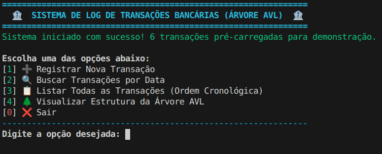
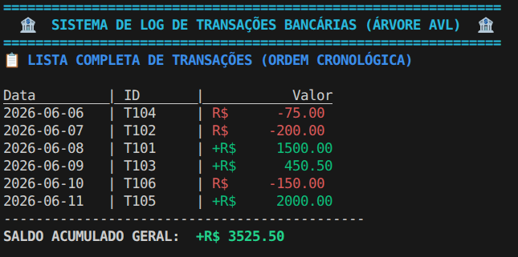
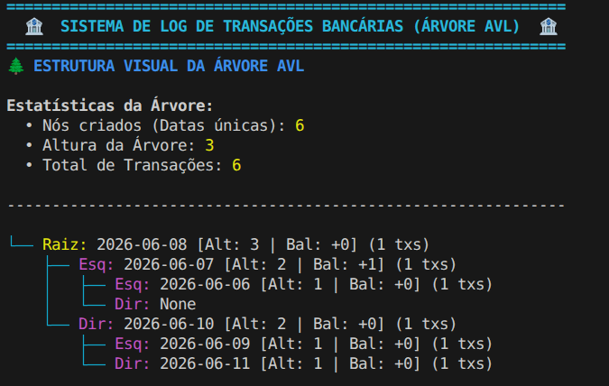

# Sistema de Log de Transações Bancárias (Árvore AVL)

**Conteúdo da Disciplina**: Árvores Balanceadas (Árvore AVL)

## Alunos
|Matrícula | Aluno |
| -- | -- |
| 232005343 |  Marcos Filho Pereira Quixabeira |
| 232027476 |  João Guilherme Capozzi |

## Sobre 
Este projeto consiste na implementação de um **Sistema de Log de Transações Bancárias**, desenvolvido na linguagem Python, com o objetivo de aplicar na prática os conceitos de Árvores Balanceadas vistos na disciplina.

O sistema utiliza uma **Árvore AVL** (`AVLTree`) para armazenar e organizar as transações. A árvore é indexada pela data da transação (`YYYY-MM-DD`). Caso múltiplas transações ocorram no mesmo dia, elas são armazenadas em uma lista encadeada dentro do nó correspondente da árvore.

Essa estrutura garante que a inserção de novas datas e a busca de transações por uma data específica ocorram em tempo logarítmico, O(log n), garantindo alta eficiência mesmo com um grande volume de dias registrados.

### Funcionalidades do Sistema (CLI):
- **Registrar Nova Transação**: Permite inserir transações (ID, valor, e data). A árvore se auto-balanceia automaticamente após cada inserção, se necessário.
- **Buscar Transações por Data**: Retorna o conjunto de transações de um dia específico com alta eficiência.
- **Listar Todas as Transações**: Realiza um percurso *in-order* na árvore AVL para listar as transações em ordem cronológica e calcula o saldo acumulado geral.
- **Visualizar Estrutura da Árvore AVL**: Exibe uma representação visual ASCII da árvore AVL no terminal, mostrando raízes, subárvores esquerdas/direitas, altura de cada nó e o fator de balanceamento para provar o correto funcionamento da estrutura.

## Estrutura do Código
O projeto está dividido em três arquivos principais para manter a organização e a responsabilidade única:
- `transaction.py`: Contém a classe `Transaction`, que define a estrutura de dados básica de uma transação.
- `avl_tree.py`: Contém a classe `AVLNode` (nó da árvore) e a classe `AVLTree` com toda a lógica de negócio estrutural (inserção, rotações para balanceamento LL, RR, LR, RL, percursos e representação em console).
- `app.py`: Interface principal do usuário via Terminal (CLI) com menus interativos, coleta de entradas e exibição de dados com cores e formatação customizada.

## Screenshots

### Menu Principal


### Listagem de Transações


### Visualização da Árvore AVL


## Instalação e Uso
**Linguagens**: Python 3.x

### Pré-requisitos
Para executar o projeto, você precisará ter o **Python** (versão 3.6 ou superior) instalado na sua máquina. O código utiliza apenas bibliotecas padrão do Python (como `sys`, `typing`, e `datetime`), logo não é necessário instalar nenhum pacote externo via `pip`.

### Passo a passo da Instalação e Execução

1. Clone o repositório ou baixe os arquivos fonte:
```bash
git clone <link-do-seu-repositorio>
cd G13_Arvore_EDA2-2026.1
```

2. Execute a aplicação principal:
```bash
python3 app.py
# ou apenas `python app.py` dependendo da configuração do seu sistema
```

3. Interaja com o Menu:
O sistema abrirá uma interface interativa no seu terminal. Algumas transações de exemplo já vêm pré-carregadas para facilitar o teste. Basta digitar o número correspondente à opção desejada e pressionar `Enter`.

## Apresentação
Assista ao vídeo de apresentação do projeto no YouTube:
[Clique aqui para assistir à apresentação](https://youtu.be/gmbePw1IQrA)
